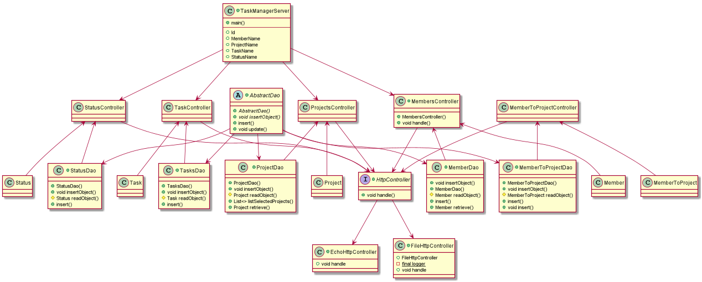
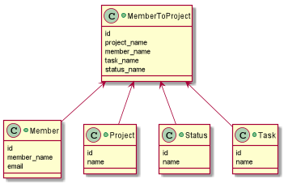

# Task manager 2.0

Link til Travis: https://travis-ci.com/Westerdals/pgr203-2019-eksamen-iaffs
Link til GitHub repository: 

Dette programmet er eksamen i PGR203 Avanasert Java av **Ingrid-Alice Bløtekjær - iaffs** og **Marcin Janecki - amish1188** for å kunne opprette prosjekt og prosjektdeltgere, samt legge til oppgaver og endre status på disse. Man kan også legge til ny statuskategori.
I programmet har man prosjekter, prosjektdeltagere, oppgaver, og status på disse, samt en hjelpetabell i databasen. Det er også et enkelt brukergrensesnitt som lar bruker opprette og tilegne deltagere prosjekter og oppgaver.

### Hvordan kjøre programmet

## Bygg og test executable jar-fil

1.) Det er lurt å kjøre mvn clean først for å rense /target og så kjøre mvn package for å opprette .jar filen som skal kjøres.
2.) Konfigurasjonsfilen må hete task-manager.properties og må inneholde følgende:
  - dataSource.url = jdbc:postgresql://localhost:5432/navnetPåDinDatabase
  - dataSource.username = brukernavn til databasebruker
  - dataSource.password = passord til databasebtukrt
6.) Etter du har kjørt mvn package kan du kjøre serveren fra target undermappen ved å benytte: java -jar target/task-manager-1.0-SNAPSHOT.jar
 
 ## Funksjonalitet
Programmet har et brukergrensesnitt som kan besøkes ved å bruke localhost:8080 i nettleseren.
Når du har fått opp brukergrensesnittet, trykker du på valget som passer deg best, enten member, project, task, status eller assign member to project. Dersom du vil sistnevnte, må du passe på å ha lagt til prosjekter, deltagere og oppgaver først, hvis ikke har det ingen hensikt.
Basert på valget ditt på første side, vil du da bli ført til en passende side for fortsettelsen på handlingen du ville gjennomføre.
Det innebærer å spesifisere navn og mail på "member", navn på "project", navn på "task" og å endre status på oppgaver på "status". På "Assign member to project" kan du tilegne en deltager et prosjekt, en oppgave og status på oppgaven.
Vi har en egen side for filtering av deltagere slik at man kan se hvilke oppgaver en deltager har.
Vi har lagt ved en home-knapp slik at du kommer deg til startsiden når du er ferdig.
 
 ## Designbeskrivelse
 

 
 ## Egenevaluering

Vi har stort sett sittet sammen og programmert, men de få gangene det ikke har vært mulig, har vi kommunisert godt over nett likevel. Vi har stadig oppdatert hverandre på fremgang og eventuelle problemer.
Vi lærte veldig mye i dette prosjektet begge to. Hvordan servere fungerer for eksempel. Det var veldig fint å se hvordan connection mellom client og server fungerer, og connection med database.

Dette har vært et emne med veldig bratt læringskurve, og vi sitter igjen med en følelse av å ha oppnådd mye forståelse på veldig kort tid, selv om det enda er mye vi ikke forstår.
 
 
 ## Hva vi lærte underveis
 
 Vi lærte at det er lurt å være aktiv med testene, gjerne i forkant av funsksjonell kode.
 Vi lærte nok en gang at kommentarer er viktige, og at de også burde gjøres underveis.
 Vi lærte at det lureste er å programmere sammen siden man får mye utbytte av hverandre i en slik prosess.
 
 ## Hva vi skulle ønske vi hadde gjort annerledes
 
 Vi skulle ønske vi klarte å gjøre koden mer "kompakt", i den forstand at vi ønsker mindre redundant kode.
 Vi skulle ønske vi rakk å implementere cookies, for det hadde vi lyst til å klare.
 Vi har mange andre endringer og forbedringer 

## Evaluering fra annen gruppe

* https://github.com/Westerdals/pgr203-assignment-3-SeventhDisaster/issues

## Evaluering gitt til annen gruppe

## Link til video
- Ingrid-Alice - https://www.youtube.com/watch?v=_mnyj84_Bgw&feature=youtu.be
- Marcin - https://www.youtube.com/watch?v=ZD0-xuIWK5Y&feature=youtu.be

