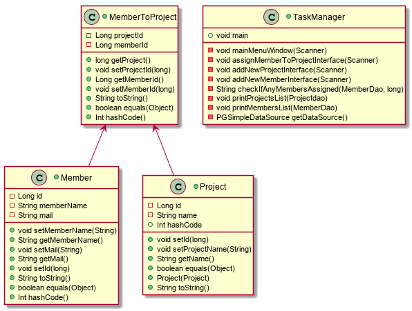

# Prosjekt og prosjektdeltager

Dette programmet er laget som en parprogrammeringsoppgave av **Ingrid-Alice Bløtekjær - iaffs** og **Marcin Janecki - amish1188** for å kunne opprette prosjekt og prosjektdeltagere ved bruk av JDBC (database).
I programmet har man prosjekter, prosjektdeltagere og en hjelpetabell. Det er også et enkelt brukergrensesnitt som lar bruker taste inn valgt kommando basert på printmelding fra programmet.

## Usage

1. For å bygge prosjektet må man kjøre mvn package shade:shade. Det kan være en fordel å kjøre mvn clean først, men det er for å sørge for at databasen har tomme tabeller når man starter.
2. For å kjøre prosjektet må man kjøre java -jar target/task-manager-1.0-SNAPSHOT-shaded.jar.
3. Man oppretter en ny prosjektdeltager ved å trykke på angitt tall i brukergrensesnittet, og det samme gjelder hvilket prosjekt man ønsker å legge prosjektdeltageren til.
 
 ## Design (valgfritt)
 

 ## Implementation notes
 
Vi er fornøyde med brukergrensesnittet vårt, hvor brukervennlig det er, og hvor enkelt det føles å taste tall i stedet for id eller hele kommandoer når man ønsker å legge til prosjekt eller prosjektdeltager.
Vi er faktisk veldig fornøyde med å ha fått til oppgaven relativt greit, og har et fungerende program, på den korte tiden og med de utfordringene vi har møtt underveis.

Vi er ikke fornøyde med å ikke ha rukket å implementere prosjektoppgaver og prosjektroller.
Vi er heller ikke fornøyd med å ikke ha fått lagt til bruk av server og HTTP i løsningen.
Og vi ser også at vi kunne ha kommentert koden bedre.

## Link to review

* https://github.com/Westerdals/pgr203-assignment-3-SeventhDisaster/issues
